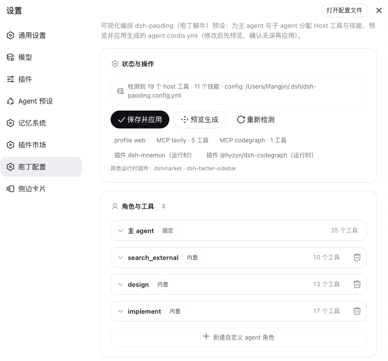

# dsh-paoding（庖丁解牛）
[English](README_en.md) · 中文

庖丁解牛，游刃有余 —— 把 DSH 调教成一支分工明确、按需加载的 agent 小团队。

dsh-paoding（中文品牌「庖丁」，典出《庄子》——庖丁顺纹理下刀，刀刃十九年若新发于硎）是 DSH（DeepSeek Harness agent 运行时）的**预设生成器**。DSH 原本是一个 agent 包揽约 60 个工具、每次请求全量加载；装上庖丁后变成「一个指挥 + 四个帮手」——主 agent 只带编排与内部搜索的精简工具，其余的活按角色委派给只带本行工具的子 agent。全部靠配置完成，**零 DSH 源码改动**。

## 功能特性

- **一支分工明确的小团队**：主 agent 当指挥，拆解任务、分派验收；联网调研、UI 设计、写代码、全仓深搜四位专属帮手各司其职，随叫随到、干完即走。
- **高频小事不过手他人**：找代码、查引用、读文件这类顺手的事，主 agent 自己直接办，不绕委派的圈子。
- **可招募专属帮手**：内置四角色只是起点——给新角色配好工具和技能（比如装上 `html-ppt` 技能的 PPT 帮手），之后一句「把这份大纲做成 PPT」就有人接活。配置文件、图形界面两个入口都能建。
- **帮手还能指定专用模型**：写代码的用强档、查资料的用轻快档，各配各的模型；不配就跟随主 agent 当前会话的模型。
- **帮手能就地续修**：把某个角色的「会话模式」切成可续（continuable），活干砸了或干得不满意，主 agent 用 `send_message` 在同一个子会话接着修，不用从头重派；默认全员一次性（one-shot）用完即弃，不开启就一切照旧。
- **省钱省上下文**：帮手的工具只在被叫到时才加载，用一次付一次；主 agent 每次请求的工具开销约降三分之二，上下文只收摘要，不再被搜索结果和代码改动撑爆。
- **角色随改随用**：删掉用不上的内置角色、给角色改显示名、给主 agent 配显示名，都是配置里一行的事；改完在面板点一次「保存并应用」，预设即时重生成，重启 DSH / 新建会话后生效。
- **装了什么都能认出来**：MCP 服务器、本地插件、已装技能，安装与配置时全程检测；默认只装 dsh 基础工具，检测到的 host 工具在「庖丁配置」里按需勾选；停用哪个，重新应用后相关工具自动剔除。
- **按工作区各有各的班底**：不同项目可以配不同的主/子 agent——「庖丁配置」里选定工作区单独配置，每个工作区生成自己的预设（`orchestrator-<目录名>`），新建会话时选对应预设即可，全局默认不受影响。
- **图形界面配置**：不习惯改配置文件的话，点开左侧栏底部动作条（设置行上方）的「庖丁配置」入口，整页点选即可，「保存并应用」与命令行走同一条生成管线。
- **版本更新有提醒，面板一键升级**：面板会对比 npm registry（GitHub release 兜底）上的最新版本，发现新版就地提示并附上发布页链接；点「升级」就地执行 `dsh plugin update dsh-paoding`（profile 自动探测）换上新版，重启 DSH 后生效，编排预设会在重启时按新版自动重生成。开发检出的 link 形态无法就地升级，面板会提示切回 registry 版的办法；检测失败（比如断网）就静默跳过，不影响任何使用。
- **来去自由**：不改 DSH 一行源码；装完新会话即用，卸载即删目录。

## 插件截图



## 快速开始

前置：**Node.js ≥ 18**、**pnpm** 与一台已装好的 DSH host（**@deepseek-ai/dsh ≥ 0.1.5**，最低支持版本）。

**官方插件通道（唯一安装入口）**——不用克隆仓库，一条命令，装完重启即用：

```bash
dsh plugin --profile web add dsh-paoding
```

等价捷径：`npx dsh-paoding@latest`（内部转成上面这条命令，默认 profile web，需本机已装 dsh）。npx 拉到哪版就装哪版：实际安装的是 `dsh-paoding@<npx 拉取到的版本>`。

`dsh plugin` 是 pnpm 的透明转发器：包被 pnpm 装进 profile，包内声明的 bundle patch 把「庖丁配置」面板挂进 DSH Web 左侧栏。**重启 DSH（`dsh web`）**即完成全部安装——插件启动时会自动检测，编排预设缺失或版本不符就自动生成一次（有 `~/.dsh/dsh-paoding.config.yml` 按配置应用，没有则写基础模板），无需再点任何按钮。新会话的预设选择器里选「编排模式 (Orchestrator)」即可；要设为默认，在 Settings → Agent Presets 里选。

开箱默认只带 DSH 自带的基础工具，检测到的 MCP/host 工具不会自动写入——装完点开左侧栏的**「庖丁配置」**按需勾选工具与角色，「保存并应用」即生效。不想要了，三条命令卸干净（按工作区配置生成的各工作区预设也一并删除）：

```bash
dsh plugin --profile web remove dsh-paoding
rm -rf "${DSH_HOME:-$HOME/.dsh}/.agent-presets/orchestrator"
rm -rf "${DSH_HOME:-$HOME/.dsh}/.agent-presets"/orchestrator-*
```

**开发检出自装**——想改插件或预设源码时，用 link 形态直连仓库（改动经 HMR/重启生效）：

```bash
git clone https://github.com/lifangjin/dsh-paoding.git
dsh plugin --profile web add link:"$PWD/dsh-paoding"
```

升级走面板「升级」按钮（等价 `dsh plugin update dsh-paoding`）。详细步骤、升级与排查见 [安装文档](docs/installation.md)。

## 怎么用

给主 agent 派活即可，它按分工自己路由：

- 找代码 / 查引用 / 读文件 → 主 agent 自己办，不委派；
- 联网查资料、做调研 → 联网调研帮手（`search_external`，只带联网工具、不改文件）；
- 出界面方案、设计稿 → 设计帮手（`design`，可加载设计技能，出 spec 不写最终代码）；
- 写代码 / 改代码 → 实现帮手（`implement`，改完自验再汇报）；
- 超大仓库全仓探索、大文件通读 → 全仓深搜帮手（`search_internal_deep`，只读、无网络，只回浓缩摘要）；
- 专属活（比如做 PPT）→ 先建自定义角色，之后随叫随到。

帮手干活期间，主 agent 可以随时追问、查看进度、叫停；结束后只把摘要收进上下文，不把帮手的完整过程倒进来。任务失败怎么恢复、怎么多轮迭代，见 [编排文档](docs/orchestration.md)。

## 配置

所有偏好都写在 `~/.dsh/dsh-paoding.config.yml`：角色增删改、技能分配、专用模型、会话模式（one-shot / continuable）、主 agent 的工具与技能……改完打开左侧栏底部的「庖丁配置」入口，点「保存并应用」即同步生效。预设每次由「静态源 + 配置」重新生成，不攒手工补丁。全部配置键说明见 [配置文档](docs/configuration.md)；背后机制与成本账见 [架构文档](docs/architecture.md)。

## 文档

| 文档 | 内容 |
|---|---|
| [架构](docs/architecture.md) | 为什么这样设计——概述、成本账、角色与工具、对应 DSH 原生机制、Token 治理、已知边界。 |
| [安装](docs/installation.md) | 官方插件通道一条命令安装、首装自动化与版本标记、升级、开发检出自装、host patch 检测机制、庖丁配置面板、卸载、排查。 |
| [编排](docs/orchestration.md) | 编排总览、失败如何呈现与三层处理、one-shot vs continuable、上下文隔离。 |
| [配置](docs/configuration.md) | 配置键全参考、内置角色微调、主 agent 工具与技能、自定义角色、按角色分模型、角色会话模式。 |

## 贡献

欢迎 issue 与 PR：使用中发现问题、想要新的角色、或发现文档与实现不一致，都可以提。动手前请先读 [架构](docs/architecture.md) 与 [配置](docs/configuration.md)；文档与实现冲突时，以 `presets/orchestrator/` 与 `tools/install.mjs` 源码为准。

## 许可

以 [MIT License](LICENSE) 发布，完整条款见仓库根目录的 `LICENSE` 文件。
