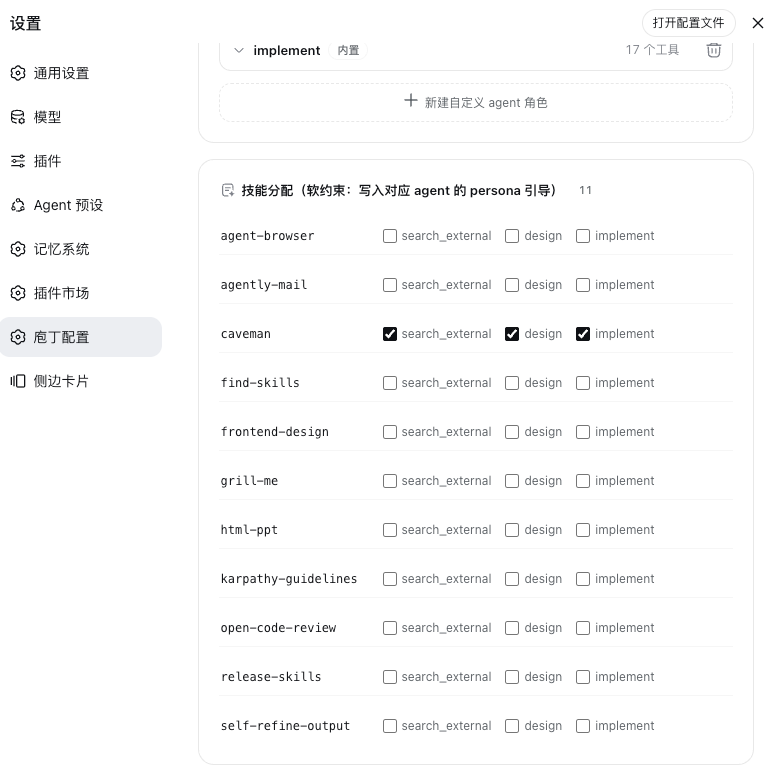
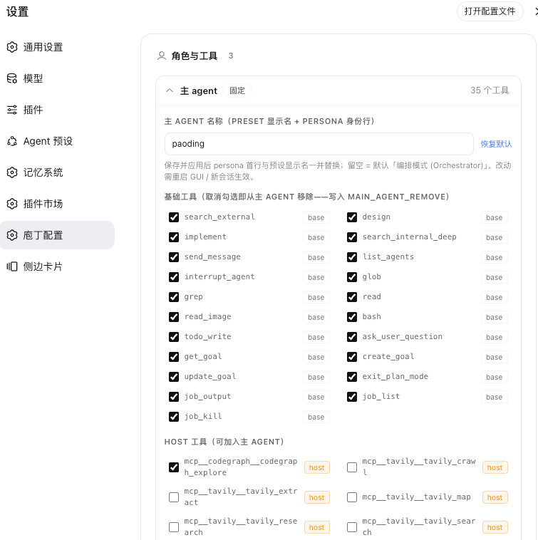
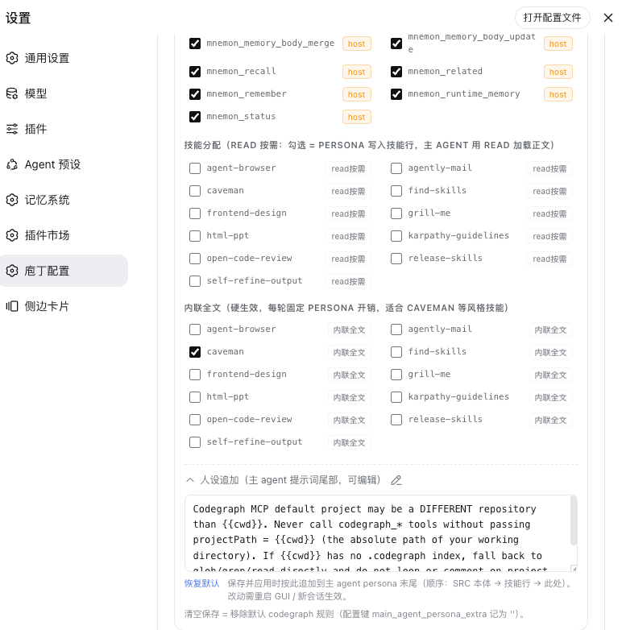
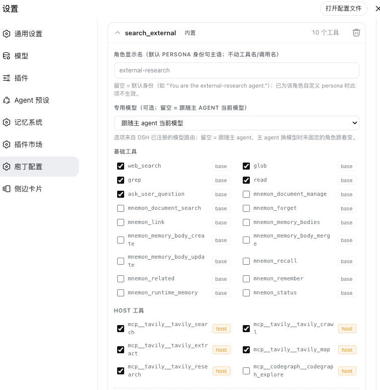
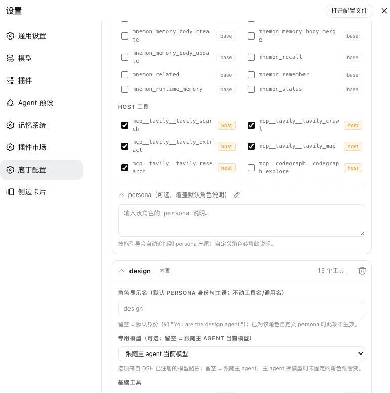

# dsh-paoding (庖丁解牛)
English · [中文](README.md)

*Pao Ding carves the ox, blade gliding through — turn DSH into a small, well-organized team of agents.*

dsh-paoding (Chinese brand 「庖丁」/ Pao Ding, from the Zhuangzi parable of the butcher whose blade never dulls because he cuts along the ox's natural seams) is a **preset generator** for DSH (DeepSeek Harness, an agent runtime). Out of the box, DSH runs one monolithic agent that loads all ~60 tools on every request; with dsh-paoding it becomes one lead plus four specialists — the main agent keeps a lean orchestration-and-search toolkit, and everything else is delegated to sub-agents that carry only the tools of their trade. Pure configuration, **zero DSH source changes**.

## Highlights

- **A small team with clear roles**: the main agent acts as the lead — it breaks work down, delegates, and reviews results. Four specialist helpers (web research, UI/design, coding, whole-repo search) each carry only their own tools, show up when called, and leave when done.
- **Everyday tasks never leave the desk**: finding code, checking references, reading files — the main agent handles those itself, no delegation round-trips.
- **Recruit your own specialists**: the four built-ins are just the start. Give a new role its tools and skills (say, an `html-ppt`-equipped slide maker), and "turn this outline into a PPT" is someone else's job from then on. Create roles in the wizard, the config file, or the config UI.
- **A dedicated model per helper**: pin the coder to a stronger model and the researcher to a lighter, faster one; unset, they follow the main agent's current session model.
- **Cheaper requests, cleaner context**: a helper's tools load only when it is called — pay per use. The main agent's per-request tool overhead drops by roughly two-thirds, and it keeps only summaries instead of accumulating search dumps and diffs.
- **Roles bend to your setup**: delete built-in roles you don't need, give roles display names, rename the main agent — all one line of config; re-run one command and the preset regenerates instantly.
- **Whatever you've installed, it's recognized**: MCP servers, local plugins, installed skills — detected throughout install and configuration; the default install carries only DSH base tools, and detected host tools are opted into per tool in **Paoding Config** (or auto-assigned with `--suggest`); disable one, re-run, and its tools drop out on their own.
- **A visual configurator**: prefer clicking to editing YAML? "Settings → 庖丁配置" covers everything, sharing the exact same generation pipeline as the CLI.
- **Installs and uninstalls cleanly**: no DSH source changes; active in a new session right after install, gone when you delete one directory.

## Screenshots












## Quick Start

Prerequisites: **Node.js ≥ 18** and a working DSH host.

**One-command install with npx (recommended)** — no clone needed:

```bash
npx dsh-paoding@latest             # available once the package is published to npm
npx github:lifangjin/dsh-paoding   # before publishing: runs straight from GitHub, same effect
```

This one command equals `--auto --config-ui`: it generates the orchestrator preset, writes the base config template, and mounts the config UI into the DSH Settings page. Out of the box the template only carries DSH's built-in base tools — detected MCP/host tools are not written in automatically. After installing, pick the tools and roles you need in **Settings → 庖丁配置 (Paoding Config)** and hit Save & Apply, or run `npx dsh-paoding --wizard` for a guided pass; add `--suggest` if you prefer the old auto-assignment.

**Clone and install** — the classic route, unchanged:

```bash
git clone <repo-url> dsh-paoding
cd dsh-paoding
./install.sh              # interactive wizard; press Enter to keep defaults
./install.sh --auto       # non-interactive: apply the config if present, else write the base template (--suggest for smart defaults)
./install.sh --config-ui  # also mount the visual configurator (can be combined with --auto)
./install.sh --dry-run    # preview what would be generated; writes nothing
./install.sh --help       # all flags
```

After installing, **restart DSH (`dsh web`) or open a new session** and pick "编排模式 (Orchestrator)" in the preset selector; to make it the default, choose it in Settings → Agent Presets. Already have a `dsh-paoding.config.yml`? Re-running any entry point applies your config file instead of overwriting it. Uninstalling means deleting the `~/.dsh/.agent-presets/orchestrator` directory (npx/npm installs also put a copy at `~/.dsh/dsh-paoding`, which you remove as well). Full steps and troubleshooting are in the [installation guide](docs/installation_en.md).

## How It Works in Practice

Just hand work to the main agent; it routes by division of labor:

- Finding code / checking references / reading files → the main agent does it itself, no delegation;
- Web research → the research helper (`search_external`: web tools only, never modifies files);
- UI designs and specs → the design helper (`design`: may load design skills, produces specs rather than final code);
- Writing / editing code → the implementation helper (`implement`: verifies its changes before reporting);
- Whole-repo exploration or full-file reads in a huge repository → the deep-search helper (`search_internal_deep`: read-only, no network, returns only a condensed summary);
- Specialized work (e.g. making PPTs) → create a custom role once, then call it anytime.

While a helper runs, the main agent can send follow-ups, check progress, or stop it; when done, it integrates only the summary, never the helper's full transcript. Failure recovery and multi-turn iteration are covered in the [orchestration guide](docs/orchestration_en.md).

## Configuration

All preferences live in `~/.dsh/dsh-paoding.config.yml`: role add/remove/tweak, skill assignment, per-role models, the main agent's tools and skills… Edit it, re-run `./install.sh --auto`, and the preset syncs. It is regenerated from "static source + config" every time, so no manual patches pile up. The full key reference is in the [configuration guide](docs/configuration_en.md); the rationale and the cost ledger are in the [architecture guide](docs/architecture_en.md).

## Documentation

| Document | Contents |
|---|---|
| [Architecture](docs/architecture_en.md) | Why it is designed this way — overview, the cost ledger, roles and tools, mapping to DSH's native mechanisms, token governance, known limits. |
| [Installation](docs/installation_en.md) | One-command install with npx, prerequisites, the six wizard stages, CLI flags, host patch detection, applying/upgrading/uninstalling, mounting the config UI, troubleshooting. |
| [Orchestration](docs/orchestration_en.md) | Orchestration overview, how failures surface and the three recovery layers, one-shot vs continuable, context isolation. |
| [Configuration](docs/configuration_en.md) | The full key reference, tuning built-in roles, main-agent tools and skills, custom roles, per-role models. |

## Contributing

Issues and PRs are welcome: report problems, request new roles, or point out where the docs and the implementation disagree. Before contributing, read the [architecture](docs/architecture_en.md) and [configuration](docs/configuration_en.md) guides; when a document and the code conflict, the source of truth is `presets/orchestrator/` and `tools/install.mjs`.

## License

Released under the [MIT License](LICENSE); see the `LICENSE` file at the repository root for the full terms.
